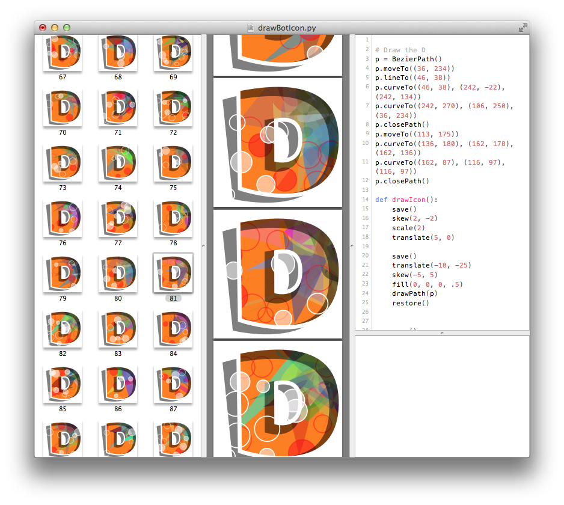

DrawBot App
===========

Drawbot has three main views:

* A :doc:`drawBotApp/codeEditor`: the place to write code.
* An Output View for `print` statements and tracebacks (reports for when your script fails).
* The :doc:`drawBotApp/preview` will preview the current page – and all generated pages, in the case of documents with multiple pages.

The :doc:`drawBotApp/preferences` window contains some settings related to the appearance of the DrawBot editor.

.. toctree::
	:titlesonly:
	:hidden:

	drawBotApp/codeEditor
	drawBotApp/preview
	drawBotApp/preferences
	drawBotApp/drawBotPackage