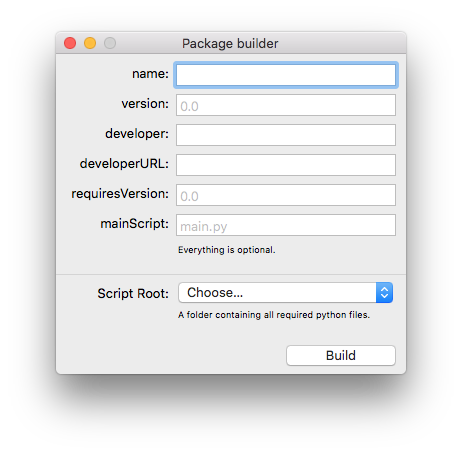

DrawBot Package
===============

A `.drawbot` package is a DrawBot app readable file containing python files.
Making it easy to share and exchange drawbot scripts.

Use a .drawbot package
----------------------

Double click the or drop the .drawbot file on top of DrawBot.

Build a .drawbot package
------------------------

Use the build in package builder to build a `.drawbot` package.

drawBot package specification
------------------------------

A `.drawbot` package is a folder with an extension.

.. code-block:: console

    <name>.drawbot (package)
        info.plist
        lib/
            main.py
            anotherScript.py
            anImage.jpg
            ...

The info plist dictionary can have the following keywords:

* `name`: optional, default to <name>.drawBot
* `version`: optional, default to 0.0, but advised to set
* `developer`: optional, default to None
* `developerURL`: optional, default to None
* `requiresVersion`: optional, default to all versions
* `mainScript`: optional, default to 'lib/main.py' if this isn't specified?)

